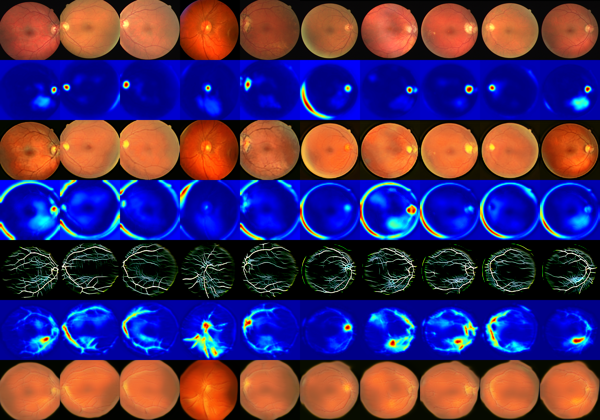

## GENERATING RETINAL IMAGES WITH A LIMITED AMOUNT OF TRAINING DATA
### YAHOR SENICHAK , MSc. ANDRII KAVETSKYI


<div style="display: flex; justify-content: center;">
  <div style="flex: 1;">
    
  </div>
  <div style="flex: 1;">
    
  </div>
</div>


### [Paper](https://arxiv.org/abs/1907.10830) | [Fundus_GAN_generator_VUT](https://t.me/fundus_gen_VUT_bot)


> **U-GAT-IT: Unsupervised Generative Attentional Networks with Adaptive Layer-Instance Normalization for Image-to-Image Translation**<br>
>
> **Abstract** *The purpose of this study is to explore the progress and application of computer vision and
generative adversarial networks (GANs3.1) in the diagnosis and study of fundus diseases.
Particular attention is paid to the latest advances in the field of medical data synthesis and
the development of our own algorithm.
Recent advances in the deep learning architecture U-GAT-IT [22], which includes two
pairs of deep neural networks (two generators and two discriminators), have been implemen-
ted. This implementation was trained for approximately 300,000 iterations, during which
positive results were obtained. The dynamics of the training process were recorded and
tests were performed to demonstrate the ability to generate high-quality synthetic images
of the ocular background independent of the input data.*

## Usage
```
├── dataset
   └── YOUR_DATASET_NAME
       ├── trainA
           ├── xxx.jpg (name, format doesn't matter)
           ├── yyy.png
           └── ...
       ├── trainB
           ├── zzz.jpg
           ├── www.png
           └── ...
       ├── testA
           ├── aaa.jpg 
           ├── bbb.png
           └── ...
       └── testB
           ├── ccc.jpg 
           ├── ddd.png
           └── ...
```

### Install dependencies
```
> pip install -r requirements.txt
```

### Train
```
> python main.py --dataset selfie2anime
```
* If the memory of gpu is **not sufficient**, set `--light` to True

### Test
```
> python main.py --dataset selfie2anime --phase test
```

### Network weights 
```
https://nextcloud.fit.vutbr.cz/s/3mYRBBpRAxArkHd
```


### For open Telegram host 
```
> python bp_bot.py
```
